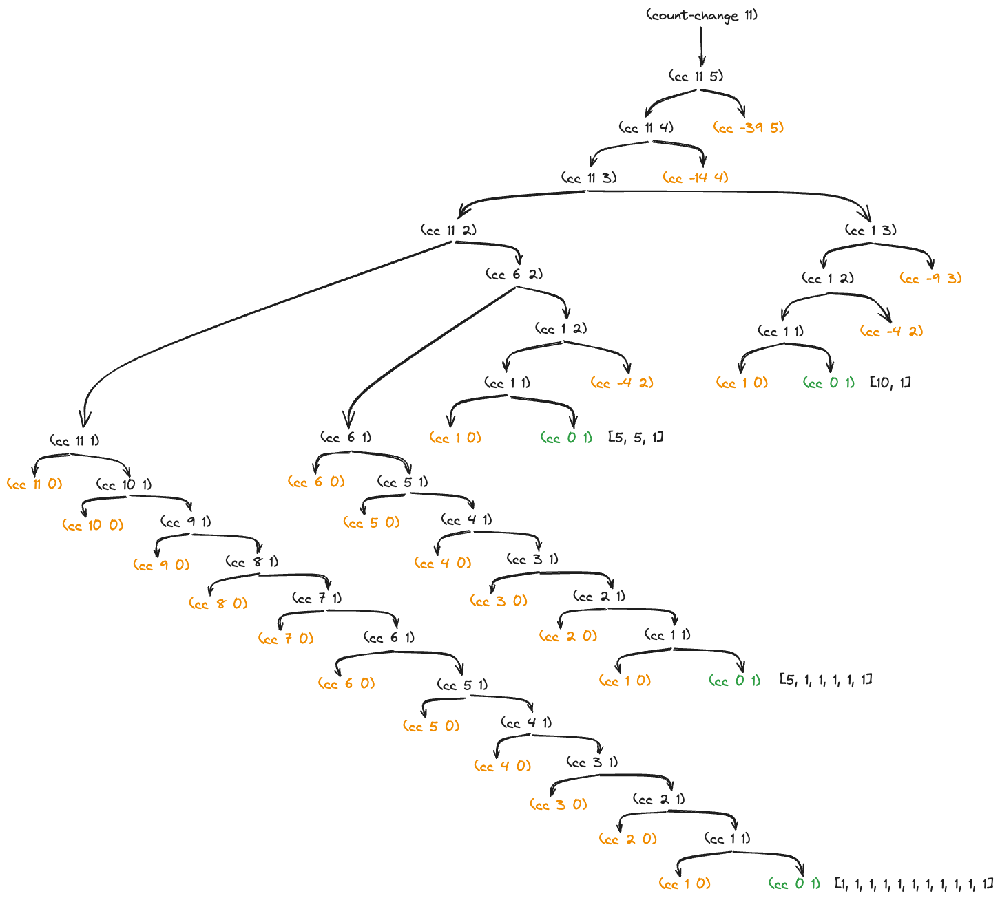

# 1.14

## Question

Draw the tree illustrating the process generated by the `count-change` procedure of section 1.2.2 in making change for 11 cents. What are the orders of growth of the space and number of steps used by this process as the amount to be changed increases?

## Answer

### Process tree

The `count-change`-directed process evolves recursively, branching outward until it hits a base case.

### Space complexity

This process stack takes up $\sum_i b_i$ units of space[^1], where $b_i$ is the depth of each branch. As seen above, the "pennies-only" branch dominates this sum, implying linear spatial growth $\Theta(n)$ with respect to `amount`.

### Time complexity

Process time (number of steps) is determined by the following recurrence relation:

$$
S(n, i) = \begin{cases}
  0                                       & \text{if } n < 0 \text{ or } i = 0, \\
  1                                       & \text{if } n = 0, \\
  S(n, i - 1) + S(n - \text{value}[i], i) & \text{otherwise}.
\end{cases}
$$

For pennies we deduce $S(n, 1) = 2n +  1 \implies \Theta(n)$ linear growth.

For nickels,

$$
\begin{align*}
  S(n, 2) & = \text{⌈}\frac{n}{5}\text{⌉} \text{ (total nickel branches)} + \sum_{i=0}^{\text{⌈}\frac{n}{5}\text{⌉}} S(n - 5i, 1) \text{ (penny branch steps)} \\
          & = \text{⌈}\frac{n}{5}\text{⌉} + \sum_{i=0}^{\text{⌈}\frac{n}{5}\text{⌉}} 2(n - 5i) + 1 \\
          & = \text{⌈}\frac{n}{5}\text{⌉} + \sum_{i=0}^{\text{⌈}\frac{n}{5}\text{⌉}} 2n - 10i + 1 \\
          & = \text{⌈}\frac{n}{5}\text{⌉} + \text{⌈}\frac{n}{5}\text{⌉} 2n - 10 \sum_{i=0}^{\text{⌈}\frac{n}{5}\text{⌉}} i + \text{⌈}\frac{n}{5}\text{⌉} \text{ (observe the $n^2$ term)} \\
          & \implies \Theta(n^2) \text{ ($n^2$ term dominates)}.
\end{align*}
$$

...

We find $\Theta(n^5)$ time growth for American coins, and $\Theta(n^i)$ in general[^2].

[^1]: Assuming no tail-recursion ($\implies \Theta(1)$ constant space).
[^2]: Inspired by [Sébastien Gignoux](https://sicp-solutions.net/post/sicp-solution-exercise-1-14/).

