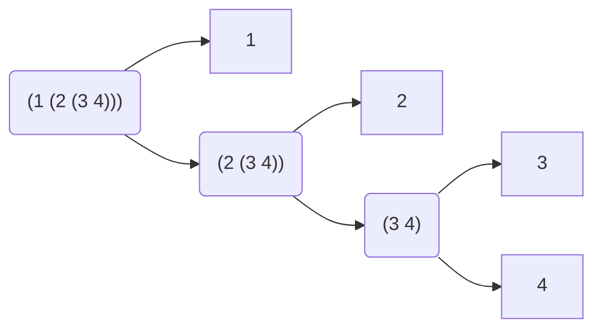

# 2.24

## Question

Suppose we evaluate the expression `(list 1 (list 2 (list 3 4)))`. Give the result printed by the interpreter, the corresponding box-and-pointer structure, and the interpretation of this as a tree (as in figure 2.6).

## Answer

```scheme
(1 (2 (3 4)))
```

Box-and-pointer and tree diagrams share the same structure:


