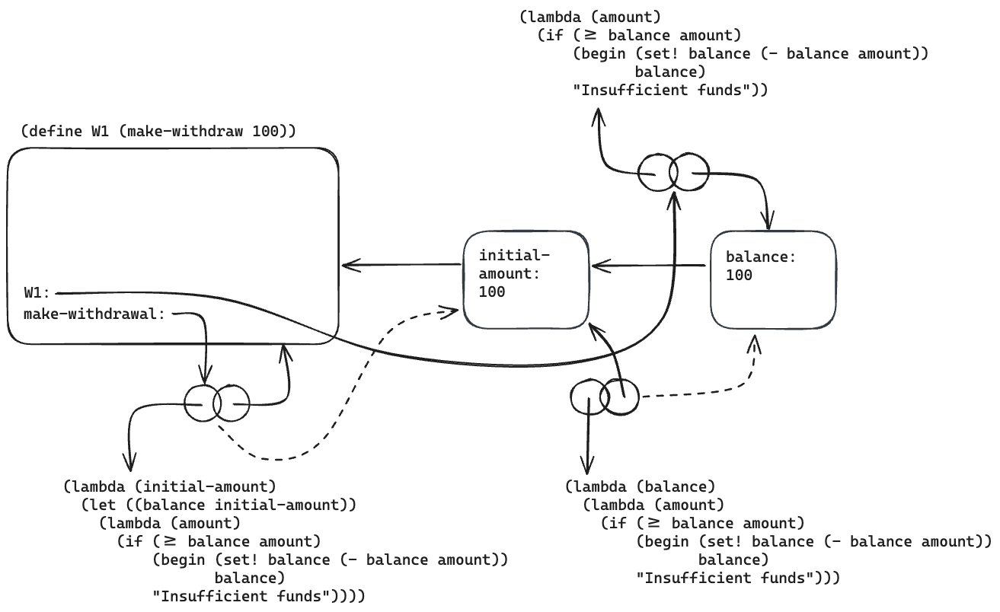
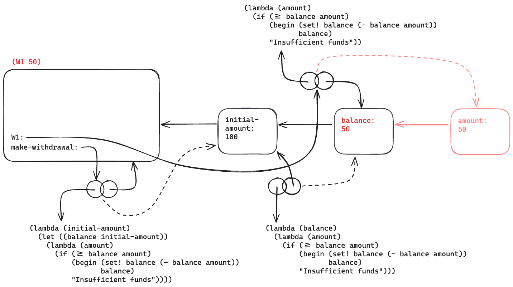
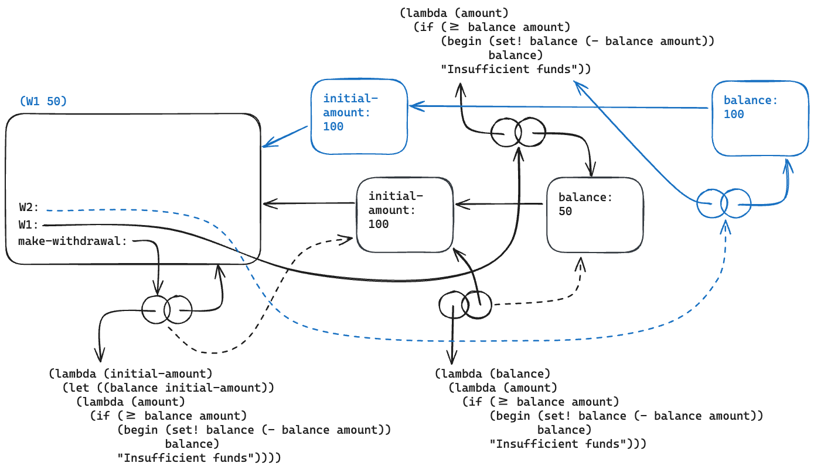

# 3.10

## Question

In the `make-withdraw` procedure, the local variable `balance` is created as a parameter of `make-withdraw`. We could also create the local state variable explicitly, using `let`, as follows:

```scheme
(define (make-withdraw initial-amount)
  (let ((balance initial-amount))
    (lambda (amount)
      (if (>= balance amount)
          (begin (set! balance (- balance amount))
                 balance)
          "Insufficient funds"))))
```

Recall from section 1.3.2 that `let` is simply syntactic sugar for a procedure call:

```scheme
(let ((<var> <exp>)) <body>)
```

is interpreted as an alternate syntax for

```scheme
((lambda (<var>) <body>) <exp>)
```

Use the environment model to analyze this alternate version of `make-withdraw`, drawing figures like the ones above to illustrate the interactions

```scheme
(define W1 (make-withdraw 100))

(W1 50)

(define W2 (make-withdraw 100))
```

Show that the two versions of `make-withdraw` create objects with the same behavior. How do the environment structures differ for the two versions?

## Answer

The environments only differ in the number of frames. `make-withdraw` above has an extra frame rebinding `initial-amount` to `balance`. The original frame containing `initial-amount` is not used in this version of the procedure.

```scheme
(define W1 (make-withdraw 100))
```



```scheme
(W1 50)
```



```scheme
(define W2 (make-withdraw 100))
```


