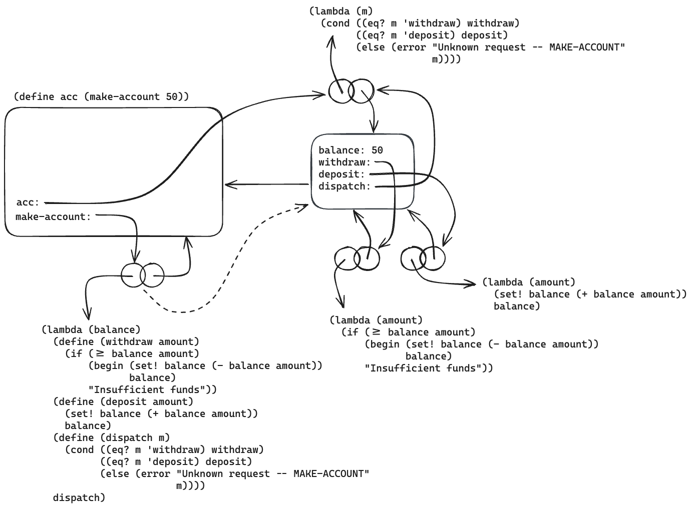
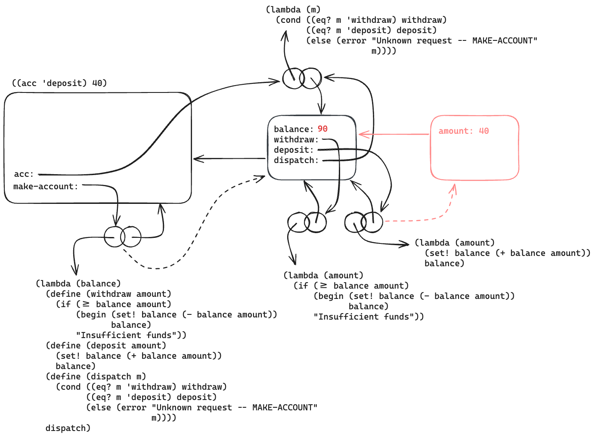
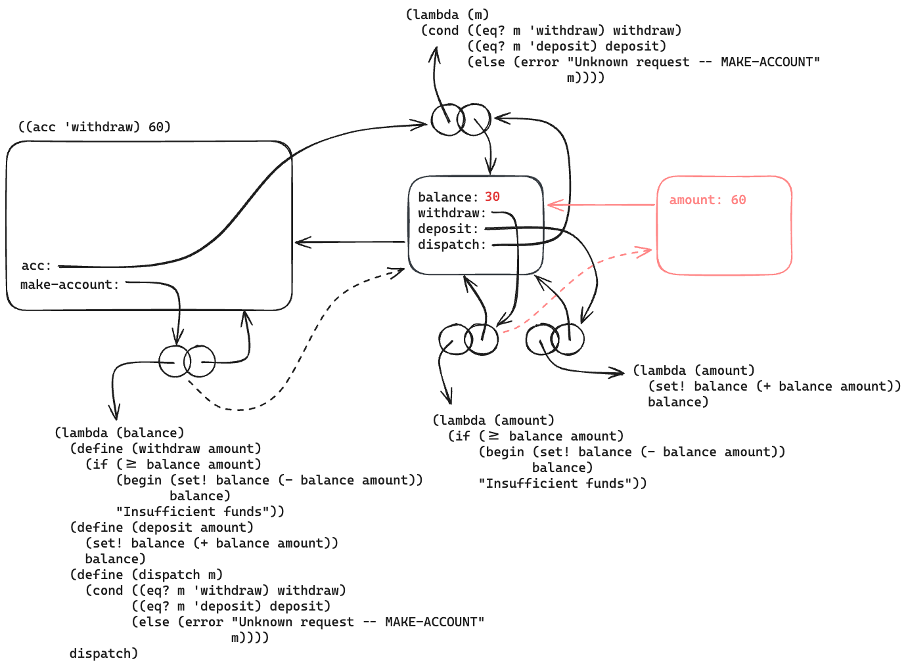

# 3.11

## Question

In section 3.2.3 we saw how the environment model described the behavior of procedures with local state. Now we have seen how internal definitions work. A typical message-passing procedure contains both of these aspects. Consider the bank account procedure of section 3.1.1:

```scheme
(define (make-account balance)
  (define (withdraw amount)
    (if (>= balance amount)
        (begin (set! balance (- balance amount))
               balance)
        "Insufficient funds"))
  (define (deposit amount)
    (set! balance (+ balance amount))
    balance)
  (define (dispatch m)
    (cond ((eq? m 'withdraw) withdraw)
          ((eq? m 'deposit) deposit)
          (else (error "Unknown request -- MAKE-ACCOUNT"
                       m))))
  dispatch)
```

Show the environment structure generated by the sequence of interactions

```scheme
(define acc (make-account 50))

((acc 'deposit) 40)
90

((acc 'withdraw) 60)
30
```

Where is the local state for `acc` kept? Suppose we define another account

```scheme
(define acc2 (make-account 100))
```

How are the local states for the two accounts kept distinct? Which parts of the environment structure are shared between `acc` and `acc2`?

## Answer

```scheme
(define acc (make-account 50))
```



```scheme
((acc 'deposit) 40)
```



```scheme
((acc 'withdraw) 60)
```



`acc`'s local state is kept in the first frame created in the application of `(make-account 50)`.

`acc` and `acc2` each have distinct internal definitions[^1] and local state. They only share Scheme primitive procedures (`>=`, `set!`, `-`, `+`, `eq?`, `error`) belonging to the local environment.

[^1]: Depending on the Scheme implementation, procedure definitions may point to the same text.
