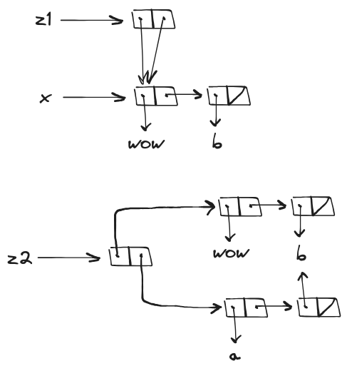

# 3.15

## Question

Draw box-and-pointer diagrams to explain the effect of `set-to-wow!` on the structures `z1` and `z2` above.

## Answer

`set-to-wow!` modifies `z1`'s `car` and `cdr`, while only affecting `z2`'s `car`.

