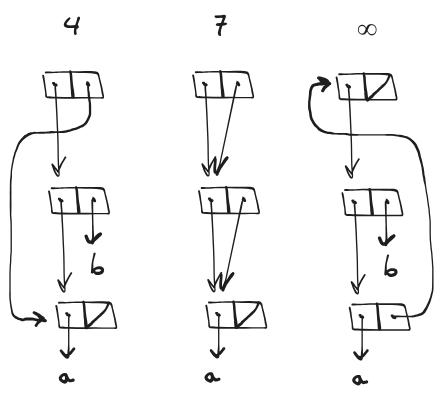

# 3.16

## Question

Ben Bitdiddle decides to write a procedure to count the number of pairs in any list structure. "It's easy," he reasons. "The number of pairs in any structure is the number in the `car` plus the number in the `cdr` plus one more to count the current pair." So Ben writes the following procedure:

```scheme
(define (count-pairs x)
  (if (not (pair? x))
      0
      (+ (count-pairs (car x))
         (count-pairs (cdr x))
         1)))
```

Show that this procedure is not correct. In particular, draw box-and-pointer diagrams representing list structures made up of exactly three pairs for which Ben's procedure would return 3; return 4; return 7; never return at all.

## Answer

Ben's procedure does not keep track of pairs it has seen already. By pointing pair entries to other pairs, we can boost `count-pairs` for data structures composed of only three pairs.



