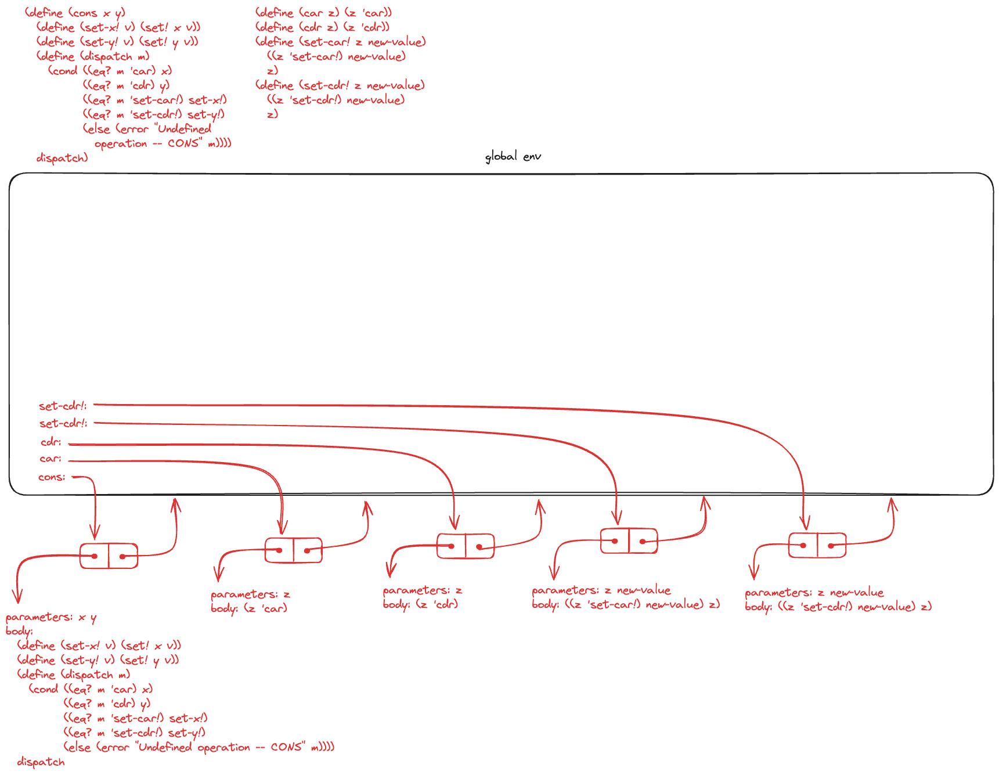
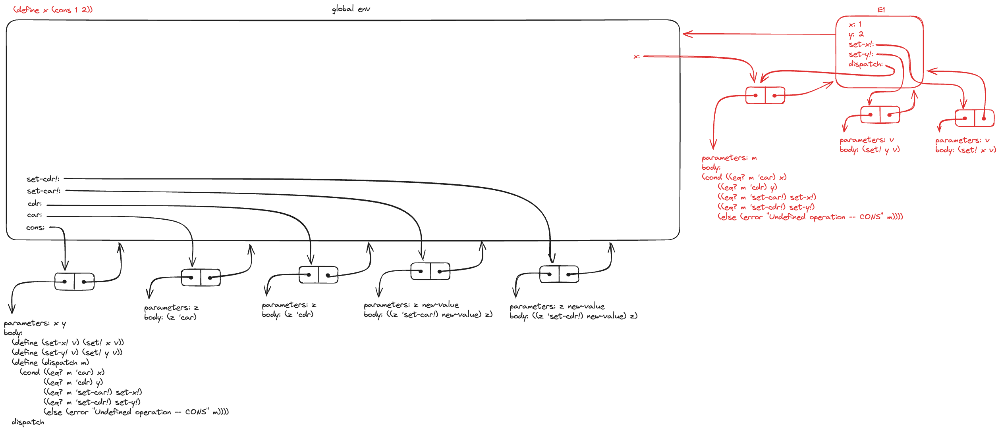
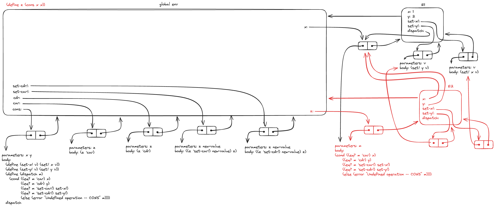
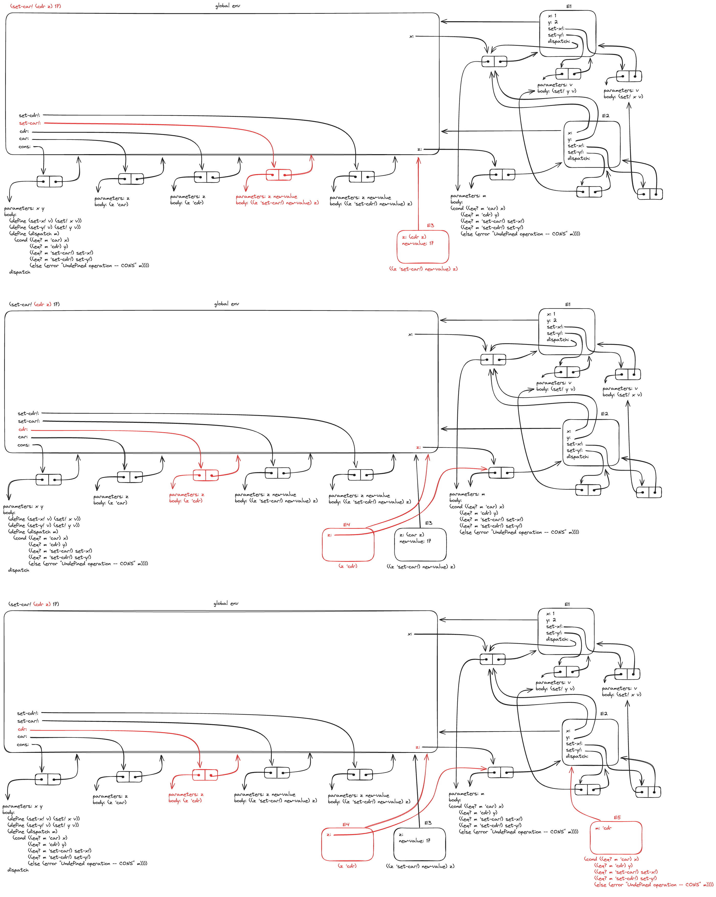
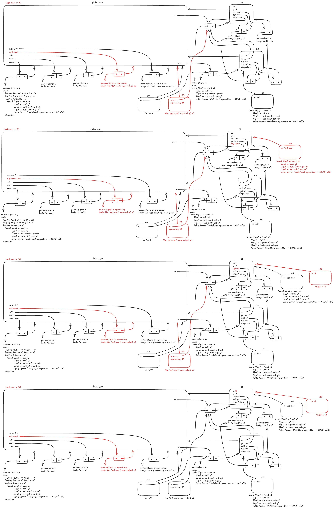
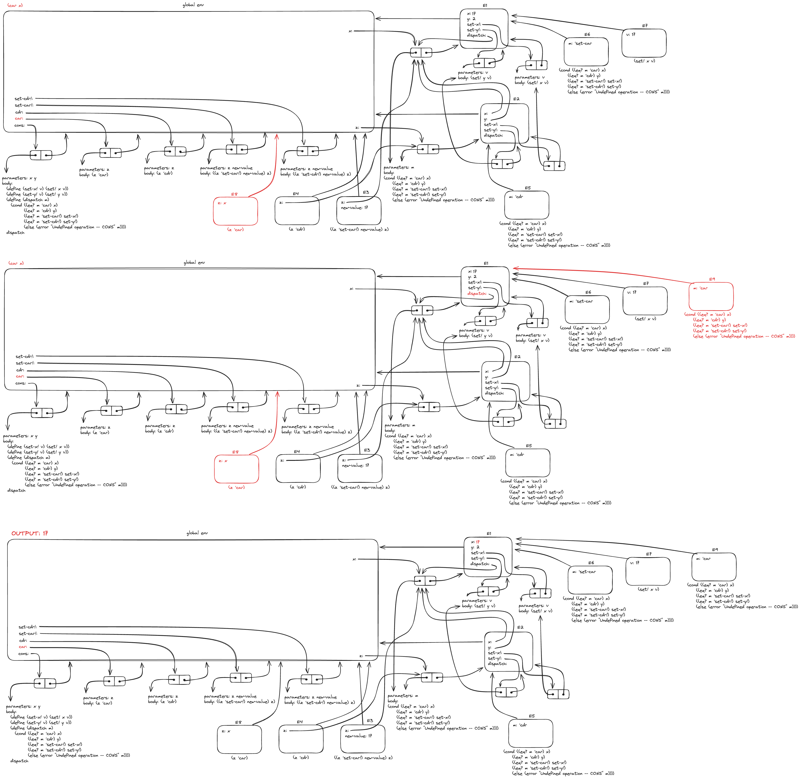

# 3.20

## Question

Draw environment diagrams to illustrate the evaluation of the sequence of expressions

```scheme
(define x (cons 1 2))
(define z (cons x x))
(set-car! (cdr z) 17)
(car x)
17
```

using the procedural implementation of pairs given above. (Compare exercise 3.11.)

## Answer

Both `cons` and Ex 3.11's `make-account` present a mutable data object by using procedures as repositories of local state[^1], assignment to modify local state, and message-passing to coordinate assignment.

```scheme
(define (make-account balance)
  ;; Mut
  (define (withdraw amount)
    (if (>= balance amount)
        (begin (set! balance (- balance amount))
               balance)
        "Insufficient funds"))
  (define (deposit amount)
    (set! balance (+ balance amount))
    balance)
  (define (dispatch m)
    (cond ((eq? m 'withdraw) withdraw)
          ((eq? m 'deposit) deposit)
          (else (error "Unknown request -- MAKE-ACCOUNT" m))))
  dispatch)
```

```scheme
(define (cons x y)
  ;; Mut
  (define (set-x! v) (set! x v))
  (define (set-y! v) (set! y v))
  (define (dispatch m)
    (cond ((eq? m 'car) x) ; Sel
          ((eq? m 'cdr) y) ; Sel
          ((eq? m 'set-car!) set-x!)
          ((eq? m 'set-cdr!) set-y!)
          (else (error "Undefined operation -- CONS" m))))
  dispatch)
;; Interface
(define (car z) (z 'car))
(define (cdr z) (z 'cdr))
(define (set-car! z new-value)
  ((z 'set-car!) new-value)
  z)
(define (set-cdr! z new-value)
  ((z 'set-cdr!) new-value)
  z)
```



```scheme
(define x (cons 1 2))
```



```scheme
(define z (cons x x))
```



```scheme
(set-car! (cdr z) 17)
```





```scheme
(car x)
17
```



[^1]: <https://mitp-content-server.mit.edu/books/content/sectbyfn/books_pres_0/6515/sicp.zip/full-text/book/book-Z-H-21.html#%_sec_3.2.3>
