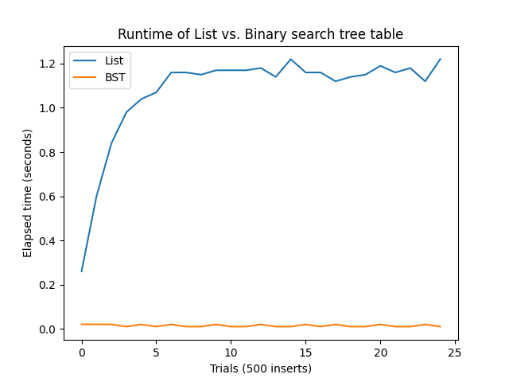

# 3.26

## Question

To search a table as implemented above, one needs to scan through the list of records. This is basically the unordered list representation of section 2.3.3. For large tables, it may be more efficient to structure the table in a different manner. Describe a table implementation where the (key, value) records are organized using a binary tree, assuming that keys can be ordered in some way (e.g., numerically or alphabetically). (Compare exercise 2.66 of chapter 2.)

## Answer

The list-based table slows down over time. The binary-tree table is both constant and instant.

