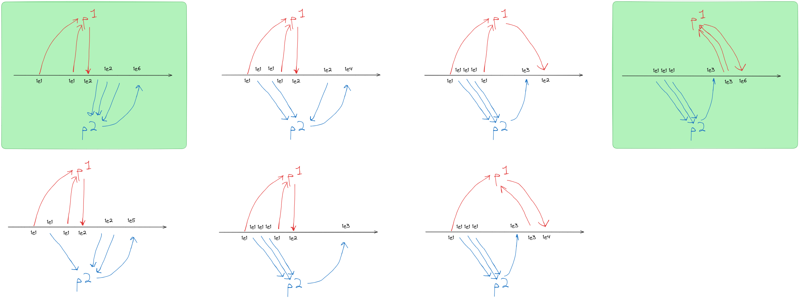

# 3.40

## Question

Give all possible values of x that can result from executing

```scheme
(define x 10)

(parallel-execute (lambda () (set! x (* x x)))
                  (lambda () (set! x (* x x x))))
```

Which of these possibilities remain if we instead use serialized procedures:

```scheme
(define x 10)

(define s (make-serializer))

(parallel-execute (s (lambda () (set! x (* x x))))
                  (s (lambda () (set! x (* x x x)))))
```

## Answer


