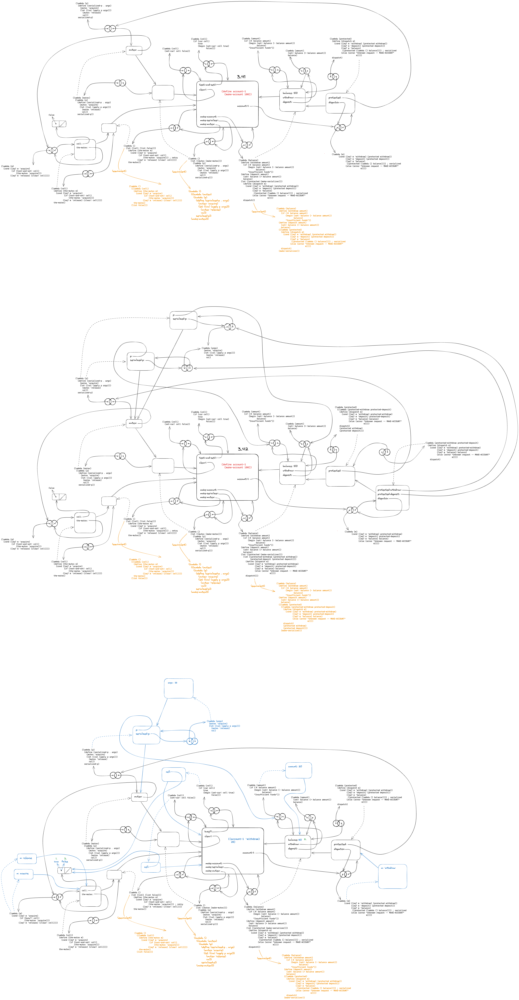

# 3.42

## Question

Ben Bitdiddle suggests that it's a waste of time to create a new serialized procedure in response to every withdraw and deposit message. He says that `make-account` could be changed so that the calls to `protected` are done outside the `dispatch` procedure. That is, an account would return the same serialized procedure (which was created at the same time as the account) each time it is asked for a withdrawal procedure.

```scheme
(define (make-account balance)
  (define (withdraw amount)
    (if (>= balance amount)
        (begin (set! balance (- balance amount))
               balance)
        "Insufficient funds"))
  (define (deposit amount)
    (set! balance (+ balance amount))
    balance)
  (let ((protected (make-serializer)))
    (let ((protected-withdraw (protected withdraw))
          (protected-deposit (protected deposit)))
      (define (dispatch m)
        (cond ((eq? m 'withdraw) protected-withdraw)
              ((eq? m 'deposit) protected-deposit)
              ((eq? m 'balance) balance)
              (else (error "Unknown request -- MAKE-ACCOUNT"
                           m))))
      dispatch)))
```

Is this a safe change to make? In particular, is there any difference in what concurrency is allowed by these two versions of `make-account`?

## Answer

It is possible Ben's version allows self-interleaving -- e.g., that two calls to `withdraw` may occur simultaneously. As we shall see, this is not how the serializer works. Therefore the change is safe for the serializer provided in the text.

Ben's version is also more efficient because the procedures are serialized once at the start instead of every time they are called:


