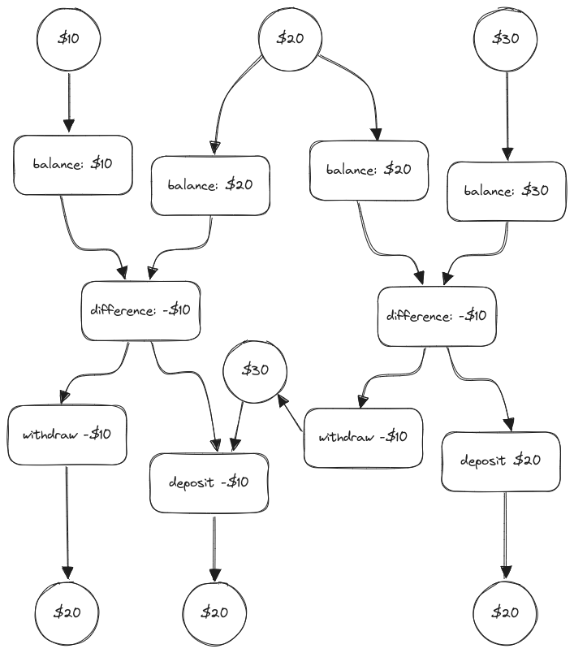
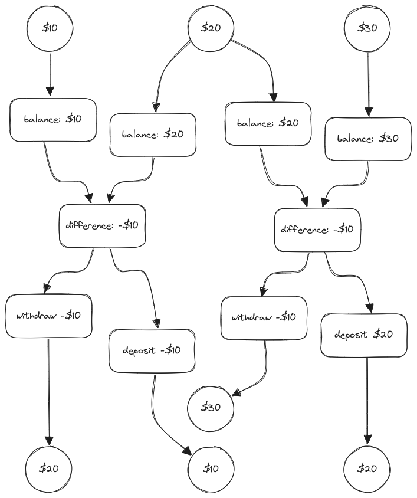

# 3.43

## Question

Suppose that the balances in three accounts start out as \$10, \$20, and \$30, and that multiple processes run, exchanging the balances in the accounts. Argue that if the processes are run sequentially, after any number of concurrent exchanges, the account balances should be \$10, \$20, and \$30 in some order. Draw a timing diagram like the one in figure 3.29 to show how this condition can be violated if the exchanges are implemented using the first version of the account-exchange program in this section. On the other hand, argue that even with this exchange program, the sum of the balances in the accounts will be preserved. Draw a timing diagram to show how even this condition would be violated if we did not serialize the transactions on individual accounts.

## Answer

```scheme
(define (serialized-exchange account1 account2)
  (let ((serializer1 (account1 'serializer))
        (serializer2 (account2 'serializer)))
    ((serializer1 (serializer2 exchange))
     account1
     account2)))
```

`((serializer1 (serializer2 exchange)) account1 account)` delays the application of `exchange` to `account1` and `account2` until both mutexes are available. (This requires `withdraw` and `deposit` to be serialized.)


This is violated by the naive version presented in the text:



However, both accounts are serialized on individual `withdraw` and `deposit`, rendering as `exchange` as a distributive operation. The total amount of money within the account economy is conserved as a consequence.

Even this is violated if transactions are not serialized:


