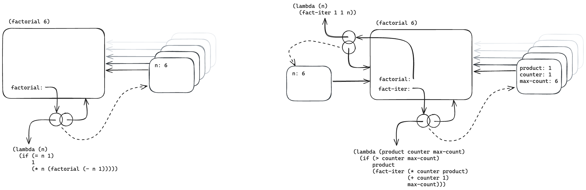

# 3.9

## Question

In section 1.2.1 we used the substitution model to analyze two procedures for computing factorials, a recursive version

```scheme
(define (factorial n)
  (if (= n 1)
      1
      (* n (factorial (- n 1)))))
```

and an iterative version

```scheme
(define (factorial n)
  (fact-iter 1 1 n))
(define (fact-iter product counter max-count)
  (if (> counter max-count)
      product
      (fact-iter (* counter product)
                 (+ counter 1)
                 max-count)))
```

Show the environment structures created by evaluating `(factorial 6)` using each version of the factorial procedure.


## Answer



The two processes create similar structures. Iteration holds more information than recursion to maintain state. Procedure calls for both are enclosed by the global environment, and not nested within each other.
