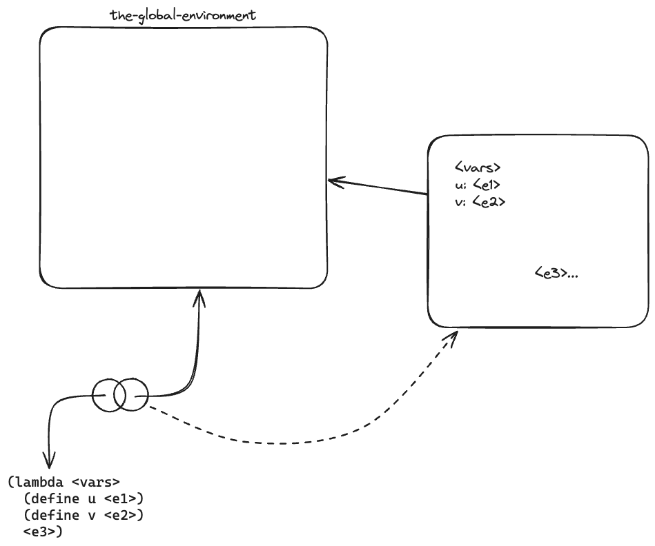
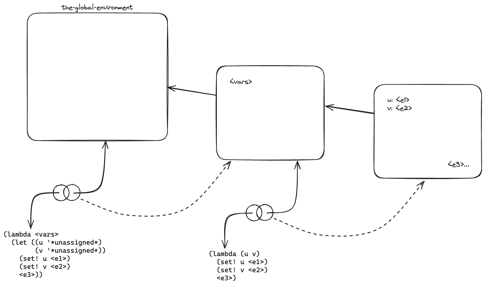

# 4.17

## Question

Draw diagrams of the environment in effect when evaluating the expression `<e3>` in the procedure in the text, comparing how this will be structured when definitions are interpreted sequentially with how it will be structured if definitions are scanned out as described. Why is there an extra frame in the transformed program? Explain why this difference in environment structure can never make a difference in the behavior of a correct program. Design a way to make the interpreter implement the "simultaneous" scope rule for internal definitions without constructing the extra frame.

## Answer

|Model|Scope|Order|
|---|---|---|
|Global|Local|Sequential|
|Procedural|Block|Simultaneous|

```scheme
(lambda <vars>
  (define u <e1>)
  (define v <e2>)
  <e3>)
```



```scheme
(lambda <vars>
  (let ((u '*unassigned*)
        (v '*unassigned*))
    (set! u <e1>)
    (set! v <e2>)
    <e3>))
```



The extra frame creates a new scope to evaluate `<e3>`. This is the same as placing definitions first, which is how "correct" programs are written.

This is exactly how we can avoid the extra frame:

```scheme
(define (scan-out-defines proc-body)
  (define (definition? exp) (tagged-list? exp 'define))
  (define (define-unassigned def)
    (make-definition (definition-variable def)
                     '*unassigned*))
  (define (definition->assignment def)
    (make-assignment (definition-variable def)
                     (definition-value def)))
  (define (defs processed) (car processed))
  (define (body processed) (cdr processed))
  (let ((processed (fold (lambda (x acc)
                           (if (definition? x)
                             (cons (cons x (car acc))
                                   (cdr acc))
                             (cons (car acc)
                                   (cons x (cdr acc)))))
                         (cons '() '())
                         proc-body)))
    (let ((new-body (append (map define-unassigned (defs processed)) ; Move definitions to top
                            (map definition->assignment (defs processed))
                            (body processed))))
      (if (null? (defs processed)) proc-body
        new-body))))
(define (make-procedure parameters body env)
  (list 'procedure parameters (scan-out-defines body) env))
```
