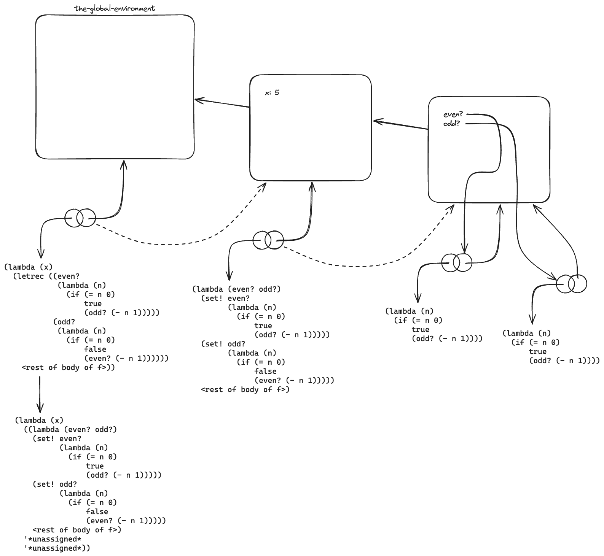

# 4.20

## Question

Because internal definitions look sequential but are actually simultaneous, some people prefer to avoid them entirely, and use the special form `letrec` instead. `Letrec` looks like `let`, so it is not surprising that the variables it binds are bound simultaneously and have the same scope as each other. The sample procedure `f` above can be written without internal definitions, but with exactly the same meaning, as

```scheme
(define (f x)
  (letrec ((even?
            (lambda (n)
              (if (= n 0)
                  true
                  (odd? (- n 1)))))
           (odd?
            (lambda (n)
              (if (= n 0)
                  false
                  (even? (- n 1))))))
    <rest of body of f>))
```

`Letrec` expressions, which have the form

```scheme
(letrec ((<var1> <exp1>) ... (<varn> <expn>))
  <body>)
```

are a variation on `let` in which the expressions `<expk>` that provide the initial values for the variables `<vark>` are evaluated in an environment that includes all the `letrec` bindings. This permits recursion in the bindings, such as the mutual recursion of `even?` and `odd?` in the example above, or the evaluation of 10 factorial with

```scheme
(letrec ((fact
          (lambda (n)
            (if (= n 1)
                1
                (* n (fact (- n 1)))))))
  (fact 10))
```

a. Implement `letrec` as a derived expression, by transforming a `letrec` expression into a `let` expression as shown in the text above or in exercise 4.18. That is, the `letrec` variables should be created with a `let` and then be assigned their values with `set!`.

b. Louis Reasoner is confused by all this fuss about internal definitions. The way he sees it, if you don't like to use define inside a procedure, you can just use `let`. Illustrate what is loose about his reasoning by drawing an environment diagram that shows the environment in which the `<rest of body of f>` is evaluated during evaluation of the expression `(f 5)`, with `f` defined as in this exercise. Draw an environment diagram for the same evaluation, but with `let` in place of `letrec` in the definition of `f`.

## Answer

### b.

#### `letrec`
```scheme
(define (f x)
  (letrec ((even?
            (lambda (n)
              (if (= n 0)
                  true
                  (odd? (- n 1)))))
           (odd?
            (lambda (n)
              (if (= n 0)
                  false
                  (even? (- n 1))))))
    <rest of body of f>))
```



#### `let`
```scheme
(define (f x)
  (let ((even?
         (lambda (n)
           (if (= n 0)
               true
               (odd? (- n 1)))))
        (odd?
         (lambda (n)
           (if (= n 0)
               false
               (even? (- n 1))))))
 <rest of body of f>))
```


Louis's plan fails because `even?` and `odd?` cannot recurse. Block structure requires two steps: creating a new scope, and updating the bound variables with assignment.
