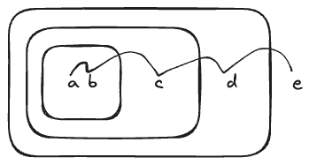

# 4.23

## Question

Alyssa P. Hacker doesn't understand why `analyze-sequence` needs to be so complicated. All the other analysis procedures are straightforward transformations of the corresponding evaluation procedures (or `eval` clauses) in section 4.1.1. She expected `analyze-sequence` to look like this:

```scheme
(define (analyze-sequence exps)
  (define (execute-sequence procs env)
    (cond ((null? (cdr procs)) ((car procs) env))
          (else ((car procs) env)
                (execute-sequence (cdr procs) env))))
  (let ((procs (map analyze exps)))
    (if (null? procs)
        (error "Empty sequence -- ANALYZE"))
    (lambda (env) (execute-sequence procs env))))
```

Eva Lu Ator explains to Alyssa that the version in the text does more of the work of evaluating a sequence at analysis time. Alyssa's sequence-execution procedure, rather than having the calls to the individual execution procedures built in, loops through the procedures in order to call them: In effect, although the individual expressions in the sequence have been analyzed, the sequence itself has not been.

Compare the two versions of `analyze-sequence`. For example, consider the common case (typical of procedure bodies) where the sequence has just one expression. What work will the execution procedure produced by Alyssa's program do? What about the execution procedure produced by the program in the text above? How do the two versions compare for a sequence with two expressions?

## Answer

```scheme
(define (analyze-sequence exps)
  (define (sequentially proc1 proc2)
    (lambda (env) (proc1 env) (proc2 env)))
  (define (loop first-proc rest-procs)
    (if (null? rest-procs)
        first-proc
        (loop (sequentially first-proc
                            (car rest-procs))
              (cdr rest-procs))))
  (let ((procs (map analyze exps)))
    (if (null? procs)
        (error "Empty sequence -- ANALYZE-SEQUENCE")
        (loop (car procs) (cdr procs)))))
```

`sequentially` returns a procedure representing the work of stepping through `procs`:



In contrast, `execute-sequence` repeats the same calls to `cond`, `null?`, `car`, and `cdr` each time `exps` is needed.

The text procedure returns the analyzed expression `proc1` directly for one expression. For two expressions, it calls a pre-computed procedure, while Alyssa's procedure calls `execute-sequence`:

|Expressions|Alyssa|Text|
|---|---|---|
|One|`(execute-sequence '(proc1))`|`proc1`|
|Two|`(execute-sequence '(proc1 proc2))`|`(lambda (env) (proc1 env) (proc2 env)`|


### Demonstration
```scheme
;; Text version
(define (analyze-sequence exps)
  (define (sequentially proc1 proc2)
    (lambda (env) (proc1 env) (proc2 env)))
  (define (loop first-proc rest-procs)
    (if (null? rest-procs)
        first-proc
        (loop (sequentially first-proc (car rest-procs))
              (cdr rest-procs))))
  (let ((procs (map analyze exps)))
    (if (null? procs)
        (error "Empty sequence -- ANALYZE"))
    (loop (car procs) (cdr procs))))

(analyze '(lambda () (display 1) (display 2) (display 3))
         the-global-environment)

;;; ...

(analyze-sequence (lambda-body exp))
(analyze-sequence (display 1) (display 2) (display 3))

(loop
  (lambda (env) (apply-primitive-procedure 'display 1))
  (list (lambda (env) (apply-primitive-procedure 'display 2))
        (lambda (env) (apply-primitive-procedure 'display 3))))

(loop
  (sequentially
    (lambda (env) (apply-primitive-procedure 'display 1))
    (lambda (env) (apply-primitive-procedure 'display 2)))
(lambda (env) (apply-primitive-procedure 'display 3)))

(loop
  (sequentially
    (sequentially
      (lambda (env) (apply-primitive-procedure 'display 1))
      (lambda (env) (apply-primitive-procedure 'display 2)))
    (lambda (env) (apply-primitive-procedure 'display 3)))
  '())

(sequentially
  (lambda (env)
    ((lambda (env) (apply-primitive-procedure 'display 1)) env)
    ((lambda (env) (apply-primitive-procedure 'display 2)) env))
  (lambda (env) (apply-primitive-procedure 'display 3)))

(lambda (env)
  ((lambda (env)
    ((lambda (env) (apply-primitive-procedure 'display 1)) env)
    ((lambda (env) (apply-primitive-procedure 'display 2)) env))
   env)
  ((lambda (env) (apply-primitive-procedure 'display 3)) env)

;; Alyssa's version
(define (analyze-sequence exps)
  (define (execute-sequence procs env)
    (cond ((null? (cdr procs)) ((car procs) env))
          (else ((car procs) env)
                (execute-sequence (cdr procs) env))))
  (let ((procs (map analyze exps)))
    (if (null? procs)
        (error "Empty sequence -- ANALYZE"))
    (lambda (env) (execute-sequence procs env))))

(analyze '(lambda () (display 1) (display 2) (display 3))
         the-global-environment)


(analyze-sequence (lambda-body exp))
(analyze-sequence (display 1) (display 2) (display 3))

(lambda (env)
  (execute-sequence
    (list (apply-primitive-procedure 'display 1)
          (apply-primitive-procedure 'display 2)
          (apply-primitive-procedure 'display 3))
    env))
```
