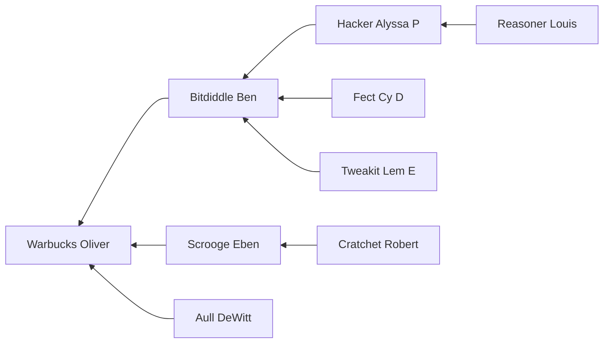

# 4.65

## Question

Cy D. Fect, looking forward to the day when he will rise in the organization, gives a query to find all the wheels (using the `wheel` rule of section 4.4.1):

```scheme
(wheel ?who)
```

To his surprise, the system responds

```scheme
;;; Query results:
(wheel (Warbucks Oliver))
(wheel (Bitdiddle Ben))
(wheel (Warbucks Oliver))
(wheel (Warbucks Oliver))
(wheel (Warbucks Oliver))
```

Why is Oliver Warbucks listed four times?

## Answer

Oliver Warbucks shows up for each way he is a "wheel" at Microshaft:



Specifically,

1. He manages Scrooge Eben, who manages Robert Cratchet
2. He manages Ben Bitdiddle, who manages Lem E Tweakit
3. He manages Ben Bitdiddle, who manages Cy D Fect
4. He manages Ben Bitdiddle, who manages Alyssa P Hacker
