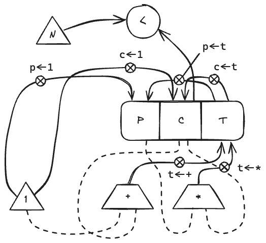
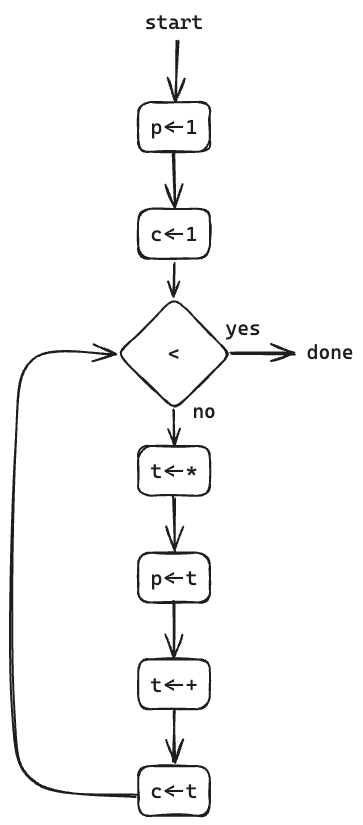

# 5.1

## Question

Design a register machine to compute factorials using the iterative algorithm specified by the following procedure. Draw data-path and controller diagrams for this machine.

```scheme
(define (factorial n)
  (define (iter product counter)
    (if (> counter n)
        product
        (iter (* counter product)
              (+ counter 1))))
  (iter 1 1))
```

## Answer

### Data-path



### Controller


