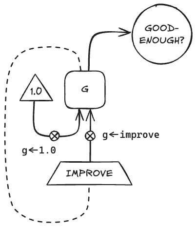
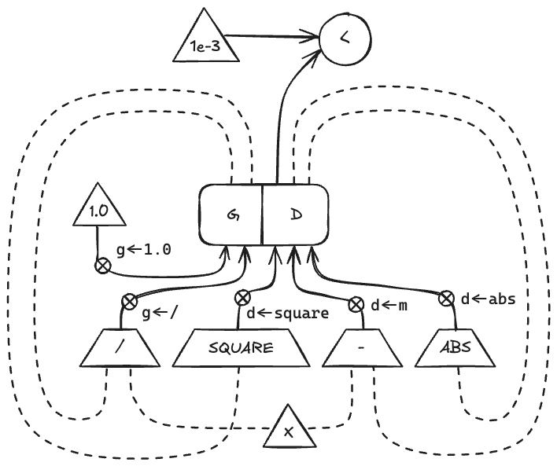

# 5.3

## Question

Design a machine to compute square roots using Newton's method, as described in section 1.1.7:

```scheme
(define (sqrt x)
  (define (good-enough? guess)
    (< (abs (- (square guess) x)) 0.001))
  (define (improve guess)
    (average guess (/ x guess)))
  (define (sqrt-iter guess)
    (if (good-enough? guess)
        guess
        (sqrt-iter (improve guess))))
  (sqrt-iter 1.0))
```

Begin by assuming that `good-enough?` and `improve` operations are available as primitives. Then show how to expand these in terms of arithmetic operations. Describe each version of the sqrt machine design by drawing a data-path diagram and writing a controller definition in the register-machine language.

## Answer

### Simple



```scheme
(controller
   (assign g (const 1.0))
 test-good-enough?
   (test (op good-enough?) (reg g))
   (branch (label sqrt-done))
   (assign g (op improve) (reg g))
   (goto (label test-good-enough?))
 sqrt-done)
```

### Expanded



```scheme
(controller
   (assign g (const 1.0))
 test-good-enough?
   (assign d (op square) (reg g))
   (assign d (op -) (reg d) (const x))
   (assign d (op abs) (reg d))
   (test (op <) (reg d) (const 0.001))
   (branch (label sqrt-done))
   (assign g (op /) (const x) (reg g))
   (goto (label test-good-enough?))
 sqrt-done)
```
